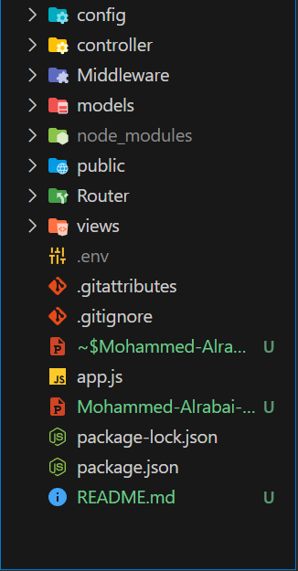
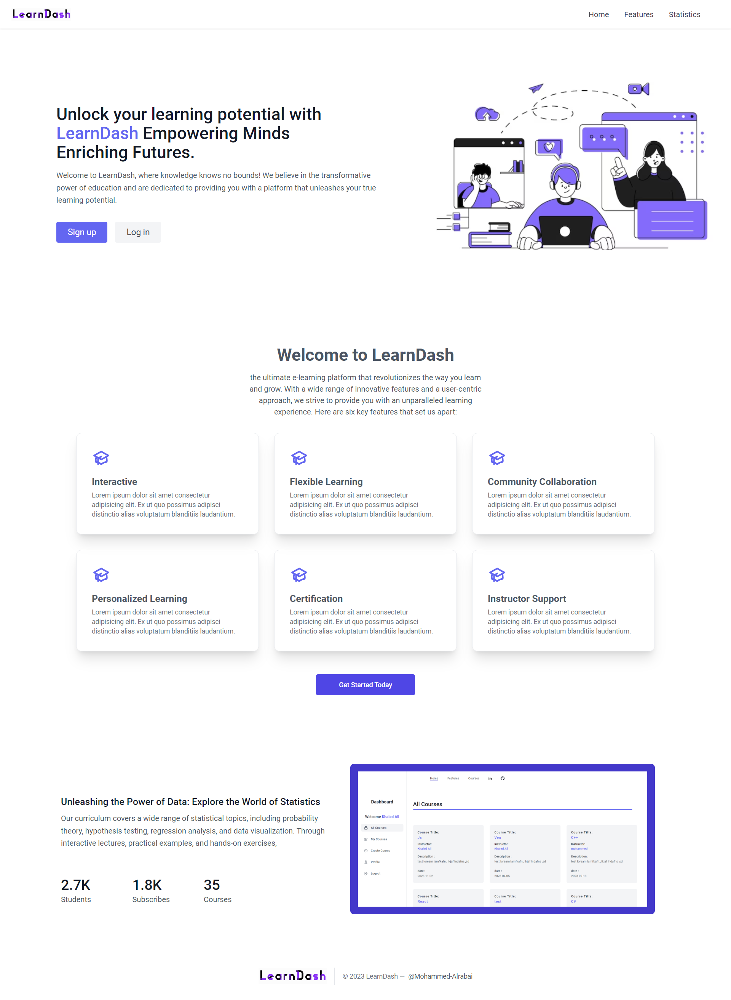
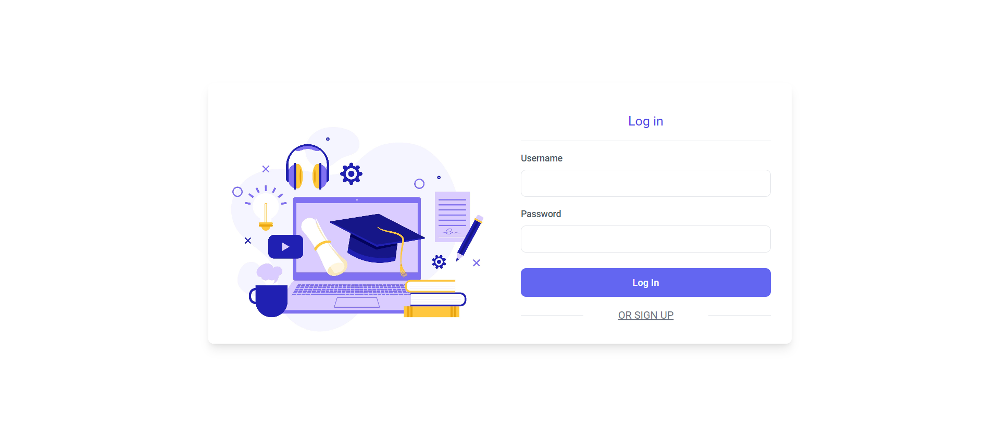
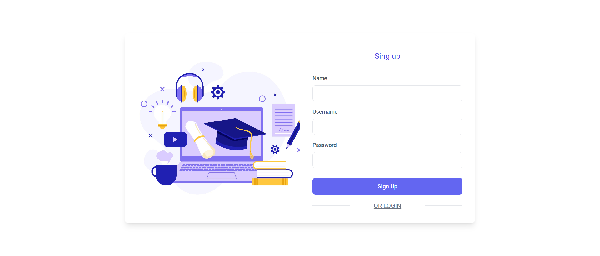
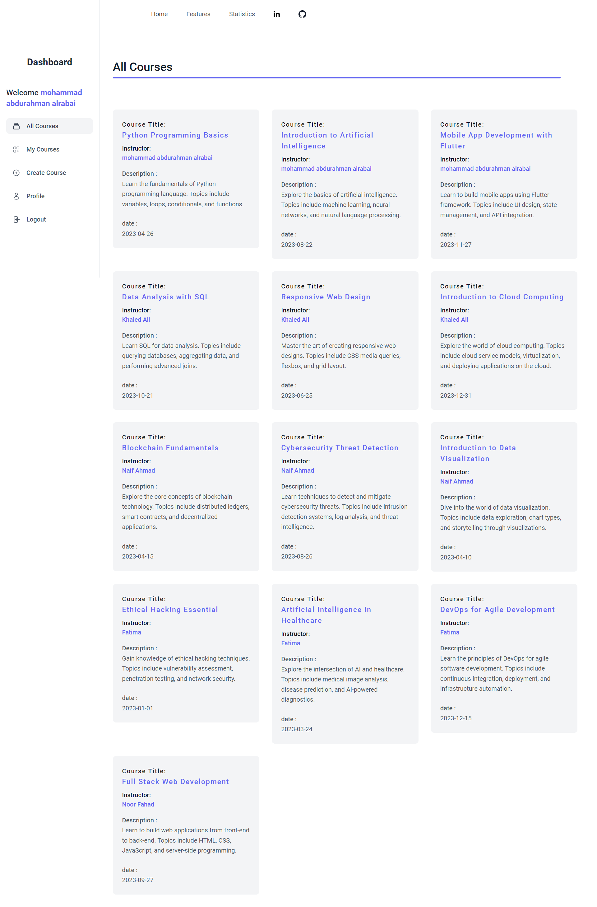

# LMS (Learning Management System)

<HR/>

### Project Overview :

Our project is about developing an e-learning platform that allows teachers to create and manage educational courses through a dashboard. Teachers can create, edit, and delete their own courses.
Through the available API in our project, students can create accounts, log in, and access all courses. They can enroll in a course and cancel their enrollment, all through the API.

<hr/>
<br>

### DEMO

<style>
    .my-button {
  background-color: #7e6ef1; 
  color: white; 
  padding: 10px 20px; 
  border: none; 
  text-align: center;
  text-decoration: none; 
  display: inline-block; 
  font-size: 16px;
  cursor: pointer;
  border-radius: 4px;
    }
  a {
        text-decoration: none;
        color: white;
  }
  a:hover{
    color: white;
    text-decoration: none;
    
}
    .my-button:hover {
        background-color: #7766f7;
    }

</style>
<BR>
    
<button class="my-button"><a
href='https://learndash-lms-learning-management-system.onrender.com/'
>DEMO</a></button>

<br>

## Technologies Used:

<hr/>

## Technologies Used Backend :

<ul>
<li>Node js
<li>Express js
<li>MongoDB 
<li>Mongoose
<li>bcrypt
<li>dotenv
<li>ejs
<li>jsonwebtoken
<li>moment
</ul>
<hr>

## Technologies Used Frontend :

<ul>
<li>Tailwind Css
<li>HeroIcons
</ul>

<hr>

## Architecture Used

## MVC And Router

<br>


<hr>

## Features :

<ul>
<li> Teacher Dashboard: A dedicated dashboard for teachers to create, edit, and delete courses.
<li>Course Management: Teachers can add new courses, update course content, and delete courses as needed.
<li>Student Interface: Students can create accounts, log in, and access all available courses.
<li>Course Enrollment: Students can enroll in courses they are interested in and cancel their enrollment if needed.
</ul>
<hr>

## Image From Website

1.Landing Page
<br>



2.Login Page



<br>
3.Sing Up Page


<br>

4.Dashboard Page



<hr>
## Installation :

### To set up the project locally, follow these steps:

1.Clone the repository using the command:

```javascript

git clone [https://github.com/Mohammed-Alrabai/-Mohammed-Alrabai--js-bootcamp-backend-final-project]
```

2.Install the project dependencies by running:

```javascript

npm install

```

3.Configure the environment variables required for the project, including database connection details and any necessary API keys.

4.Start the development server using the command:

```javascript

npm start

```

<br>
<br>
<h1 style="color:blue">Happy coding!</h1>
